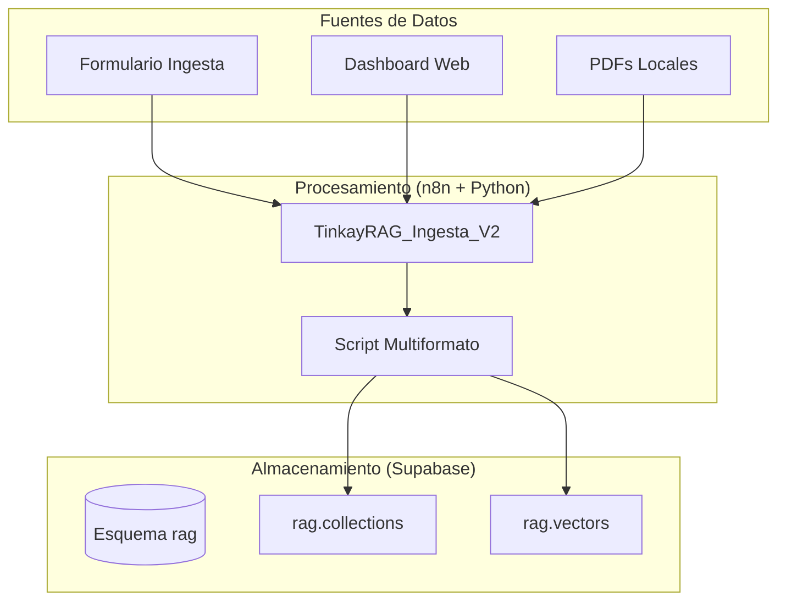
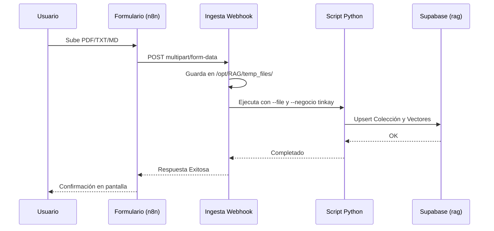

# 🌸 Manual Técnico RAG - Tinkay

Este documento detalla la implementación del sistema de **Generación Aumentada por Recuperación (RAG)** para el ecosistema **Tinkay**, bajo una arquitectura multinegocio escalable.

---

---

## 🏗️ 1. Arquitectura Multinegocio
El sistema ha sido migrado de una estructura monolítica a un esquema relacional que permite separar el conocimiento por unidades de negocio utilizando el parámetro `negocio`.



- **Esquema de BD:** `rag`
- **Identificador Tinkay:** `tinkay`
- **Visibilidad Default:** `publico`

---

## 🔄 2. Proceso de Ingesta (Carga de Datos)

El flujo de ingesta permite cargar conocimiento desde diversas fuentes, soportando ahora archivos locales y remotos.

### Componentes:
- **Flujo n8n:** `TinkayRAG_Ingesta_V2_Multiformato` (ID: `XT2mlHdZxQ01Sp6L`)
- **Script de Procesamiento:** `/opt/RAG/implementacion_SARA/Ingesta_PDF_WEB.py` (Versión Multiformato)

### Formatos Soportados:
- **PDF:** Extracción de texto con PyMuPDF.
- **TXT / MD:** Lectura directa de archivos de texto plano y Markdown.
- **Web:** Scraping dinámico de URLs.

### Modos de Carga:
1. **Carga por Archivo (POST):**
   Envío directo del archivo al webhook mediante un POST multipart. El sistema guarda temporalmente el archivo, lo procesa y lo elimina al finalizar.
   ```bash
   curl -X POST https://sara.mysatcomla.com/webhook/rag-kt-ingesta \
        -F "file=@mi_documento.pdf" \
        -F "source=Manual_Usuario"
   ```
2. **Carga por URL (Web):**
   Envío de un JSON con la URL a scrapear.
   ```json
   { "type": "web", "url": "https://tinkay.com/info", "title": "Info Tinkay" }
   ```
3. **Carga vía Formulario (Interfaz):**
   Para usuarios que prefieren una interfaz visual, existe un flujo con formulario dedicado.
   - **Flujo:** `TinkayRAG_FormularioIngesta_V1` (ID: `EHanlWl3s6udKydv`)
   - **URL del Formulario:** `https://sara.mysatcomla.com/form/tinkay-form-ingesta`



---

## 🔍 3. Proceso de Consulta (Recuperación)

Permite al agente SARA buscar información específica de Tinkay para responder preguntas.

### Componentes:
- **Flujo n8n:** `TinkayRAG_Consulta_V1` (ID: `3e30HCu1WMRq14oF`)
- **Motor de Búsqueda:** Función RPC `rag.match_documents`.

### Lógica de Filtrado:
A diferencia del sistema anterior, las consultas ahora filtran estrictamente por:
- `p_negocio = 'tinkay'`
- `p_estado = 'ACTIVO'`
- `p_visibilidad = 'publico'` (o privado según el usuario).

---

## 💬 4. Prueba de Consulta (Chat)

- **Flujo de Chat:** `eiseWnDVUMV8L49D`
- **Interfaz:** Dashboard Tinkay / SARA Chat Widget.
Este flujo actúa como el orquestador final que recibe la pregunta del usuario, llama al flujo de consulta y genera la respuesta final con Gemini.

---

## 🗄️ 5. Estructura Supabase (Esquema `rag`)

### Tablas Principales:
1. **`rag.collections`**: Almacena las fuentes de información.
   - `id`, `name`, `negocio`, `tipo`, `source_url`, `visibilidad`, `estado`.
2. **`rag.vectors`**: Almacena los fragmentos y sus vectores.
   - `id`, `collection_id` (FK), `content`, `embedding` (3072 dims).

### Funciones SQL:
- **`rag.match_documents`**: Realiza la búsqueda de similitud de coseno con filtros de negocio y estado.

---

## 🤖 6. Dependencias y Modelos

### Inteligencia Artificial (Google Gemini):
- **Embeddings:** `gemini-embedding-2-preview` (Dimensiones: 3072).
- **Generación:** `gemini-1.5-flash` (Rápido y eficiente para respuestas de chat).

### Infraestructura:
- **Orquestador:** n8n SARA (Auto-hosteado en `https://sara.mysatcomla.com`).
- **Base de Datos:** Supabase (`ufnpzxlvpwagavoytwco`).
- **Entorno Python:** PyMuPDF, Supabase-py, Google-GenAI.
- **Directorios Servidor:** 
  - Scripts: `/opt/RAG/implementacion_SARA/`
  - Temporales: `/opt/RAG/temp_files/` (Para carga de archivos vía POST)

---
*Manual generado por Antigravity - Proyecto TINKAY 2026*
